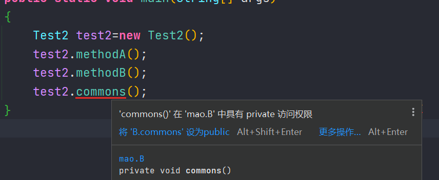

## 接口方法私有化

### 概述

当我们在一个接口里写多个默认方法或者静态方法的时候，可能会遇到程序重复的问题。我们可以把这些重复的程序提取出来，创建一个新的方法，用private进行修饰，这样就创造了一个只有接口可以调用的私有方法


### 使用

以前写法：

```java
package mao;

/**
 * Project name(项目名称)：JDK9_interface_method_privatization
 * Package(包名): mao
 * Interface(接口名): A
 * Author(作者）: mao
 * Author QQ：1296193245
 * GitHub：https://github.com/maomao124/
 * Date(创建日期)： 2023/10/31
 * Time(创建时间)： 12:29
 * Version(版本): 1.0
 * Description(描述)： 无
 */

public interface A
{
    default void methodA()
    {
        System.out.println("methodA...");
        System.out.println("A....");
        System.out.println("B....");
        System.out.println("C....");
    }

    default void methodB()
    {
        System.out.println("methodB...");
        System.out.println("A....");
        System.out.println("B....");
        System.out.println("C....");
    }
}
```


```java
package mao;

/**
 * Project name(项目名称)：JDK9_interface_method_privatization
 * Package(包名): mao
 * Class(类名): Test1
 * Author(作者）: mao
 * Author QQ：1296193245
 * GitHub：https://github.com/maomao124/
 * Date(创建日期)： 2023/10/31
 * Time(创建时间)： 12:38
 * Version(版本): 1.0
 * Description(描述)： 无
 */

public class Test1 implements A
{
    public static void main(String[] args)
    {
        Test1 test1=new Test1();
        test1.methodA();
        test1.methodB();
    }
}
```


```sh
methodA...
A....
B....
C....
methodB...
A....
B....
C....
```


现在的写法

```java
package mao;

/**
 * Project name(项目名称)：JDK9_interface_method_privatization
 * Package(包名): mao
 * Interface(接口名): B
 * Author(作者）: mao
 * Author QQ：1296193245
 * GitHub：https://github.com/maomao124/
 * Date(创建日期)： 2023/10/31
 * Time(创建时间)： 12:33
 * Version(版本): 1.0
 * Description(描述)： 无
 */

public interface B
{
    default void methodA()
    {
        System.out.println("methodA...");
        commons();
    }

    default void methodB()
    {
        System.out.println("methodB...");
        commons();
    }

    /**
     * 定一个私有的方法，把重复部分的代码抽离出来。然后在methodA与methodB方法内部去调用
     * 私有方法只能在本类中调用，这里包括接口的实现类也不能调用
     */
    private void commons()
    {
        System.out.println("A....");
        System.out.println("B....");
        System.out.println("C....");
    }
}
```


```java
package mao;

/**
 * Project name(项目名称)：JDK9_interface_method_privatization
 * Package(包名): mao
 * Class(类名): Test2
 * Author(作者）: mao
 * Author QQ：1296193245
 * GitHub：https://github.com/maomao124/
 * Date(创建日期)： 2023/10/31
 * Time(创建时间)： 12:40
 * Version(版本): 1.0
 * Description(描述)： 无
 */

public class Test2 implements B
{
    public static void main(String[] args)
    {
        Test2 test2=new Test2();
        test2.methodA();
        test2.methodB();
        //test2.commons();
    }
}
```


```sh
methodA...
A....
B....
C....
methodB...
A....
B....
C....
```


调用私有方法：




